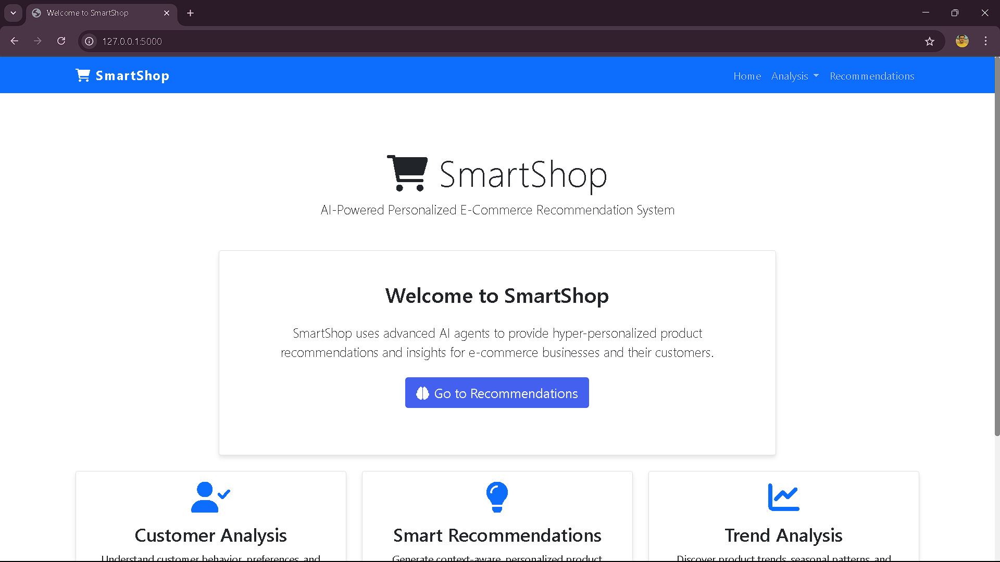
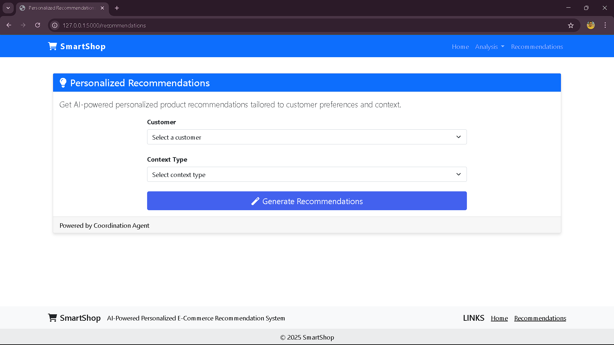

# SmartShop: AI-Powered Personalized E-Commerce Recommendation System

SmartShop is a multi-agentic AI system that delivers hyper-personalized product recommendations for e-commerce platforms. It leverages the power of multiple specialized AI agents, each focusing on a specific aspect of the recommendation process, to analyze customer behavior, understand product relationships, and deliver tailored recommendations.

## Key Features

- **Multi-Agent Architecture**: Specialized agents for customer analysis, product analysis, and recommendation generation working together
- **Personalized Recommendations**: Tailored product suggestions based on customer behavior, preferences, and context
- **Context-Aware Recommendations**: Recommendations based on occasions, seasons, and specific product categories
- **Long-Term Memory**: SQLite database for persistent storage of customer data, product information, and agent memories
- **LLM Integration**: Seamless integration with Ollama for generating insights and natural language explanations
- **Flexible Query Options**: Different recommendation types for various business needs
- **Web Interface**: User-friendly web UI for interacting with the multi-agent system

## Architecture

SmartShop uses a multi-agent system consisting of four main agents:

1. **Customer Agent**: Analyzes customer behavior and preferences
2. **Product Agent**: Manages product information and relationships between products
3. **Recommendation Agent**: Generates personalized product recommendations
4. **Coordination Agent**: Orchestrates interactions between the other agents

Each agent has specific tools and capabilities for its domain, and they communicate through a shared SQLite database. The system uses Ollama for LLM-based reasoning and text generation.


## Screenshots

- **Home**


- **Dashboard**




## Installation

### Prerequisites

- Python 3.8 or higher
- Access to an Ollama server (default: http://localhost:11434)
- The dataset files (or use sample data)

## Usage

### Web Interface

Run the web application:
```bash
python run_smartshop.py
```

Then open your browser and navigate to http://localhost:5000 to access the SmartShop web interface. The web UI provides a user-friendly way to:

- Initialize the system and load data
- View and analyze customer profiles
- Analyze products and their relationships
- Generate personalized recommendations
- Explore category trends and seasonal recommendations

## Project Structure

```
smartshop/
├── agents/                 # Agent implementations
│   ├── base_agent.py       # Base Agent class
│   ├── customer_agent.py   # Customer analysis agent
│   ├── product_agent.py    # Product analysis agent
│   ├── recommendation_agent.py # Recommendation generation agent
│   └── coordination_agent.py # Agent coordination
├── data/                   # Data storage
│   └── smartshop.db        # SQLite database (created on init)
├── models/                 # ML models (if needed)
├── static/                 # Web UI static assets
│   ├── css/                # CSS styles
│   └── js/                 # JavaScript files
├── templates/              # Web UI HTML templates
├── utils/                  # Utility modules
│   ├── database.py         # Database utilities
│   └── llm.py              # LLM interaction utilities
├── config.py               # Configuration settings
├── data_loader.py          # Script to load data
├── main.py                 # Command-line interface
├── web_app.py              # Web application
└── __init__.py
```

## Technical Details

### Agent Memory System

Each agent maintains its own memory in the SQLite database, categorized into:
- **Experiences**: Records of past interactions and their outcomes
- **Observations**: Facts or data points the agent has observed
- **Plans**: Strategies and action plans created by the agent
- **Reflections**: Analysis and insights generated by the agent

### Recommendation Engine

The recommendation system combines multiple approaches:
- Content-based filtering
- Collaborative filtering (similar customers)
- Contextual recommendations (season, occasion)
- Category-specific recommendations

### Web Interface

The web interface is built with:
- Flask: Lightweight web framework
- Bootstrap: Responsive design framework
- AJAX: Dynamic content loading
- Interactive forms for generating recommendations and analyses

### LLM Integration

SmartShop uses Ollama, specifically the qwen2.5:0.5b model, for:
- Generating personalized explanations
- Analyzing customer behavior and preferences
- Understanding product relationships
- Providing insights and trend analysis

## Setting Up Ollama LLM

SmartShop uses Ollama to provide local LLM capabilities for generating recommendations and insights. Follow these steps to set it up:

1. Install Ollama from [https://ollama.com/download](https://ollama.com/download)

2. Start the Ollama server:
   ```bash
   ollama serve
   ```

3. Pull the required model:
   ```bash
   ollama pull qwen2.5:0.5b
   ```

4. Alternatively, you can use the automated setup script:
   ```bash
   python run_smartshop.py --test
   ```

## Getting Started

1. Start the Ollama server:
   ```bash
   ollama serve
   ```

2. Run the web application:
   ```bash
   python run_smartshop.py
   ```

3. Open your browser and navigate to:
   ```
   http://localhost:5000
   ```

4. Follow the setup steps in the web interface:
   - Check Ollama LLM status and setup if needed
   - Initialize the system (creates database)
   - Load sample data or your own data
   - Start exploring recommendations and insights!

## Configuration

You can configure the system by modifying `smartshop/config.py`:

- `OLLAMA_BASE_URL`: The URL of your Ollama instance (default: "http://localhost:11434")
- `OLLAMA_LLM_MODEL`: The LLM model to use (default: "qwen2.5:0.5b")
- Other system settings like embedding dimensions, recommendation thresholds, etc.

## License

This project is licensed under the MIT License - see the LICENSE file for details.

## Acknowledgments

- This project was created for the Accenture Hackathon
- The dataset was provided by Accenture
- Ollama for providing the LLM capabilities 
